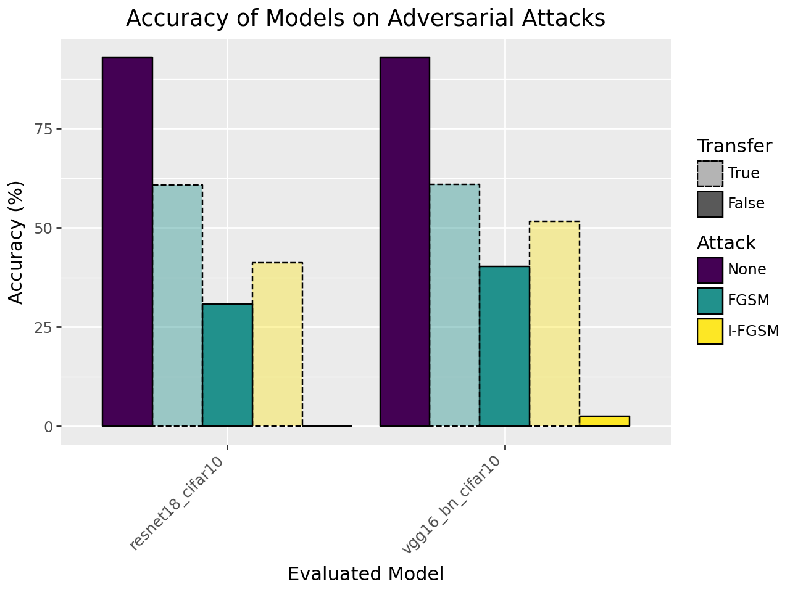

# Adversarial Examples in the Physical World - Reproduction

This repository contains a PyTorch-based partial reproduction and analysis of the paper:

**Adversarial Examples in the Physical World**  
*Alexey Kurakin, Ian Goodfellow, Samy Bengio* (2017)  
[Paper Link](https://arxiv.org/abs/1607.02533)

---

## 📖 Project Overview

Adversarial examples are carefully crafted inputs designed to fool machine learning models. This project reproduces key experiments from the paper, generating and evaluating adversarial perturbations on image classification models (ResNet, and VGG16) with the CIFAR-10 dataset.

The goals include:  
- Understanding the robustness of models to adversarial attacks  
- Comparing different attack methods (FGSM, Iterative FGSM)  
- Analyzing transferability of attacks across models  
- Visualizing original vs adversarial images  

---

## Models and Algorithms

We train adversarial attack samples against two models: **resnet18_cifar10** and **vgg16_bn_cifar10**.

- **ResNet-18 (CIFAR-10)**:  
  Based on the [ResNet architecture](https://arxiv.org/abs/1512.03385), ResNet-18 introduces residual connections that help train deeper neural networks by mitigating the vanishing gradient problem. The version used here is trained on CIFAR-10 and available via [Hugging Face](https://huggingface.co/edadaltocg/resnet18_cifar10). 

- **VGG16 with Batch Normalization (CIFAR-10)**:  
  The [VGG16 architecture](https://arxiv.org/abs/1409.1556) is characterized by its deep, sequential convolutional layers with small (3x3) filters. The batch normalization variant (VGG16_BN) improves training stability and convergence. The model used here is also trained on CIFAR-10 and available on [Hugging Face](https://huggingface.co/edadaltocg/vgg16_bn_cifar10). 

We produce attack samples by FGSM and I-FGSM algorithms:

- **FGSM (Fast Gradient Sign Method):**  
  FGSM is a single-step attack that perturbs the input image in the direction of the gradient of the loss with respect to the input. The adversarial example \( x_{\text{adv}} \) is generated as:
  
  \[
  x_{\text{adv}} = x + \epsilon \cdot \text{sign}(\nabla_x J(\theta, x, y))
  \]
  
  where:
  - \( x \) is the original input image,
  - \( y \) is the true label,
  - \( \theta \) are the model parameters,
  - \( J(\theta, x, y) \) is the loss function,
  - \( \epsilon \) controls the magnitude of the perturbation.

   See the original paper: [Explaining and Harnessing Adversarial Examples (Goodfellow et al., 2014)](https://arxiv.org/abs/1412.6572)

- **I-FGSM (Iterative Fast Gradient Sign Method):**  
  I-FGSM applies FGSM multiple times with a small step size, clipping the result after each step to ensure the perturbation stays within the allowed range. The adversarial example after \( N \) iterations is:
  
  \[
  x^{(0)}_{\text{adv}} = x
  \]
  \[
  x^{(n+1)}_{\text{adv}} = \text{Clip}_{x, \epsilon} \left\{ x^{(n)}_{\text{adv}} + \alpha \cdot \text{sign} \left( \nabla_x J(\theta, x^{(n)}_{\text{adv}}, y) \right) \right\}
  \]
  
  where:
  - \( \alpha \) is the step size for each iteration,
  - \( \text{Clip}_{x, \epsilon} \) ensures the adversarial example stays within an \( \epsilon \)-ball of the original input \( x \).

  See the original paper: [Adversarial Examples in the Physical World (Kurakin et al., 2017)](https://arxiv.org/abs/1607.02533)

## Accuracy Comparison

The bar chart above summarizes the accuracy of both ResNet-18 and VGG16_BN models on the CIFAR-10 test set under different adversarial scenarios:

- **None:** Accuracy on clean (unperturbed) images.
- **FGSM:** Accuracy after applying the Fast Gradient Sign Method attack.
- **I-FGSM:** Accuracy after applying the Iterative FGSM attack.

Each group of bars shows results for a specific model. The color of the bars indicates the type of attack, while the border style distinguishes between direct attacks (solid) and transfer attacks (dashed).  
- **Direct attack:** Adversarial examples are generated and evaluated on the same model.
- **Transfer attack:** Adversarial examples are generated on one model and evaluated on the other, testing the transferability of adversarial examples.

The hyperparameters used for this run were:
- **Epsilon, \(\epsilon\) = 4** (in image space [0, 255])
- **Alpha \(\alpha\) = 1** (in image space [0, 255], for I-FGSM step size)
- **Iterations for I-FGSM = 10**

Note: Since the network inputs are normalized, both epsilon and alpha are scaled accordingly to match the normalized data range during attack generation.

**Evaluation protocol:**  
Accuracy was computed on a random selection of 50 images from each of the 10 CIFAR-10 classes (total 500 images). This is to ensure class balance while keeping computaitonal cost low.

**Observations:**
- Both models achieve high accuracy on clean data.
- Accuracy drops significantly under FGSM attacks, and even more so under I-FGSM, demonstrating the increased effectiveness of iterative attacks.
- Transfer attacks (dashed bars) also reduce accuracy, though the effect may be less severe than direct attacks.

---

## 🚀 How to Run

### Google Colab (Good for GPU usage)

This project is fully compatible with Google Colab for easy GPU use.

1. Open the Colab notebook here:  
   

2. Follow the notebook cells step-by-step:  
   - Install dependencies  
   - Load models and the cifar-10 dataset 
   - Generate adversarial datasets  
   - Run evaluations and visualize results  

---

